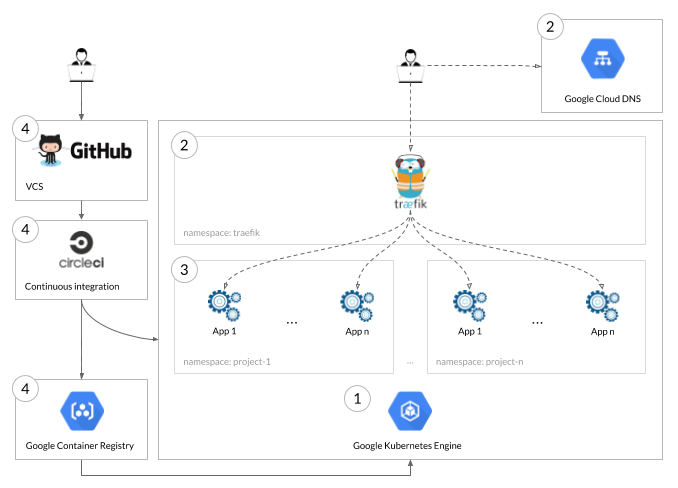

# CI/CD Platform Deployment

## Motivations

As people start new projects, they usually spend some precious time to deploy and configure a CI/CD pipeline. At Zenika
Labs, our goal is to reach proofs of concept or minimum viable products as efficiently as possible, without 
compromising on quality.

This guide shows how to spin up the pipeline we use everyday to build, test and deploy our applications. As demonstrated
at Zenika's Technozaure event on April 3rd, 2018, it can even be achieved in less than an hour!

We usually use it with a *feature branch* workflow, i.e. each new feature is implemented in a new branch. As shown in 
the provided [sample project](sample_project), our CI/CD pipeline allows us to create and maintain an application
instance per feature, accessible from anywhere and at anytime. This scheme goes in the direction of our
*Definition of Done*, which requires a code review and a validation from a Product Owner before deploying to production.


## Architecture and outline

Our pipeline follows the architecture and uses the services and tools pictured below.



The following sections will describe how to assemble them step by step.


## Requirements

For that, you will need
- an AWS account, with full access rights
- a GitHub account, with ability to create and configure projects
- a CircleCI account linked to your GitHub account, with ability to configure builds


## 1. Rancher master

### Deploy Rancher master on AWS

Go to the [Rancher on RancherOS AMI page](https://aws.amazon.com/marketplace/pp/B072PSBJB2) and click `Subscribe`.
Choose:
- version (currently `1.1.0`)
- region (for us, `EU (Frankfurt)`)
- VM type (`t2.medium` is sufficient)
- VPC Settings (you can keep the default)
- SSH Key Pair for remote access (needs to be created beforehand in the [EC2 console](https://eu-central-1.console.aws.amazon.com/ec2/v2/home?region=eu-central-1#KeyPairs:sort=keyName))

Validate you choices by clicking on `Launch with 1-click`.

In the [EC2 Instances Dashboard](https://eu-central-1.console.aws.amazon.com/ec2/v2/home?region=eu-central-1#Instances:sort=instanceId), name your instance as you like.


### Associate a static IP to your Rancher master

Click on `Allocate new address` on the [EC2 Elastic IP Dashboard](https://eu-central-1.console.aws.amazon.com/ec2/v2/home?region=eu-central-1#Addresses:sort=PublicIp).

Select the instance you just created and validate by clicking on `Associate`.

In the following steps, we will call this IP address `<RANCHER_MASTER_IP>`.

Your instance should now be accessible at `<RANCHER_MASTER_IP>:8080`.


### Configure your DNS to access Rancher

You can now map an URL you own to Rancher using this IP. In the following steps, we will call it `<RANCHER_URL>`.

In your DNS configuration, you need to following `A` record:
```
<RANCHER_URL>     A     <RANCHER_IP>
```

We use [AWS Route 53](https://console.aws.amazon.com/route53/home#hosted-zones:) to manage our domains.

Your instance should now be accessible at `<RANCHER_URL>:8080`.


### Configure access control in your Rancher Instance

In your Rancher Instance, go to `Admin > Access Control`.

For simplicity, we will use a `Local` access control with username/password configuration.


## 2. Rancher hosts

### Create a Rancher user on AWS

In the [IAM Users dashboard](https://console.aws.amazon.com/iam/home?region=eu-central-1#/users), click on `Add user`.

Name it as you like, tick `Programmatic access` and go to the next screen.

Give it the `EC2 Full Access` policy in the `Attach existing policies directly` tab.

Validate, review and click on `Create user`.

In the next screen, write down the `Access key ID` and `Secret access key`. These will allow Rancher to use the AWS API.


### Create Rancher hosts using AWS.

In Rancher, click on `Add Host` in `Infrastructure > Hosts`.

Pick the Amazon EC2 machine driver and choose:
- region (for us, `eu-central-1`)
- access key (created in the previous step)
- secret key (created in the previous step)

In the next screen, choose:
- the availability zone (pick any)
- VPC/Subnet (there should be only one choice)

In the next screen, choose the standard security group (more on this later).

In the next screen, choose at least:
- name (the name prefix for your hosts)
- quantity (the number of hosts you want to create)
- root size (this disk size)

Validate your choices by clicking on `Create`.


## 3. Traefik

### Create a Rancher API key for Traefik

In Rancher, click on `Add Environment API Key` in the `Environment API Keys` section of `API > Keys` to create a new key.

In the next screen, write down the `Access key` and `Secret key`. These will be used by Traefik to connect to the Rancher API.


### Deploy Traefik in Rancher

In Rancher, pick one of your hosts in `Infrastucture > Hosts` and open the edition menu. Add a `traefik_lb` label with value `true`. In the following steps, we will call `<TRAEFIK_IP>` the IP address of this host.

In AWS, associate a static IP Address to this host (follow the same logic we used to associate a static IP to the Rancher master).

In Rancher, click on `Add Stack` in `Stacks > User`. Name it as you like (e.g., `traefik`) and use the following Docker Compose file as configuration.

Substitute:
- `<RANCHER_URL>` with Rancher's URL.
- `<RANCHER_ACCESS_KEY>` with Traefik's Access key (created in the previous step).
- `<RANCHER_SECRET_KEY>` with Traefik's Secret key (created in the previous step).

```yaml
version: '2'
services:
  traefik:
    image: traefik:1.6
    command: --rancher --rancher.domain=http://<RANCHER_URL> --rancher.endpoint=http://<RANCHER_URL>:8080 --rancher.refreshseconds=5 --rancher.accesskey=<RANCHER_ACCESS_KEY> --rancher.secretkey=<RANCHER_SECRET_KEY>
    labels:
      - "io.rancher.scheduler.affinity:host_label=traefik_lb=true"
    ports:
      - 80:80
```

The `io.rancher.scheduler.affinity:host_label=traefik_lb=true` label on the `traefik` service will ensure that it is always deployed on the host with IP `<TRAEFIK_IP>`.


### Configure your DNS to redirect a subdomain to Traefik

For each project you want to host on this platform, pick a subdomain you own and redirect it to your Traefik instance. In the following steps, we will call it `<PROJECT_SUBDOMAIN>`.

In your DNS configuration, you need to following `A` record:
```
*.<PROJECT_SUBDOMAIN>     A     <TRAEFIK_IP>
```

We use [AWS Route 53](https://console.aws.amazon.com/route53/home#hosted-zones:) to manage our domains.


## 4. Generate SSL Certificates with Let's Encrypt (optional)

Traefik can generate a Let's Encrypt wildcard SSL certificate for you, provided it can modify your DNS configuration to respond to Let's Encrypt challenge.

### Create a Traefik user on AWS

In the [IAM Users dashboard](https://console.aws.amazon.com/iam/home?region=eu-central-1#/users), click on `Add user`.

Name it as you like, tick `Programmatic access` and go to the next screen.

Give it the `Route53 Full Access` policy in the `Attach existing policies directly` tab.

Validate, review and click on `Create user`.

In the next screen, write down the `Access key ID` and `Secret access key`. These will allow Traefik to use the AWS API.


### Redeploy Traefik in Rancher

In Rancher, delete the previous `traefik` stack, then click on `Add Stack` in `Stacks > User`. Use the following Docker Compose file as configuration.

Substitute:
- `<RANCHER_URL>` with Rancher's URL.
- `<RANCHER_ACCESS_KEY>` with Traefik's Access key to Rancher (same as before).
- `<RANCHER_SECRET_KEY>` with Traefik's Secret key to rancher (same as before).
- `<AWS_ACCESS_KEY>` with Traefik's Access key to AWS (created in the previous step).
- `<AWS_SECRET_KEY>` with Traefik's Secret key to AWS (created in the previous step).
- `<AWS_REGION>` the code of your AWS region (can be found in the url when editing your DNS configuration).
- `<AWS_HOSTED_ZONE_ID>` the id of your Route53 Hosted Zone (can be found in the url when editing your DNS configuration).
- `<EMAIL>` the email address to register with the SSL certificate.
- `<PROJECT_SUBDOMAIN>` the domain you chose before.

```yaml
version: '2'
services:
  traefik:
    image: traefik:1.6
    command: --rancher --rancher.domain=http://<RANCHER_URL> --rancher.endpoint=http://<RANCHER_URL>:8080 --rancher.refreshseconds=5 --rancher.accesskey=<RANCHER_ACCESS_KEY> --rancher.secretkey=<RANCHER_SECRET_KEY> --entryPoints='Name:http Address::80 Redirect.EntryPoint:https' --entryPoints='Name:https Address::443 TLS' --defaultentrypoints='https,http' --acme --acme.entrypoint=https --acme.email=<EMAIL> --acme.storage=acme.json --acme.dnsChallenge --acme.dnsChallenge.provider=route53 --acme.domains='*.<PROJECT_SUBDOMAIN>'
    environment:
      - "AWS_ACCESS_KEY_ID: <AWS_ACCESS_KEY>"
      - "AWS_HOSTED_ZONE_ID: <AWS_HOSTED_ZONE_ID>"
      - "AWS_REGION: <AWS_REGION>"
      - "AWS_SECRET_ACCESS_KEY: <AWS_SECRET_KEY>"
    volumes:
      - /acme.json:/acme.json
    ports:
      - 80:80
      - 443:443
    labels:
      - "io.rancher.scheduler.affinity:host_label=traefik_lb=true"
```


## 5. Docker Registry

### Add container registry permissions for the Rancher user on AWS

In the [IAM Users dashboard](https://console.aws.amazon.com/iam/home?region=eu-central-1#/users), edit the Rancher user you created before and select `Add permissions`. 

Give it the `AmazonEC2ContainerRegistryFullAccess` policy in the `Attach existing policies directly` tab.


### Create a CircleCI user on AWS

In the [IAM Users dashboard](https://console.aws.amazon.com/iam/home?region=eu-central-1#/users), click on `Add user`.

Name it as you like, tick `Programmatic access` and go to the next screen.

Give it the `AmazonEC2ContainerRegistryFullAccess` policy in the `Attach existing policies directly` tab.

Validate, review and click on `Create user`.

In the next screen, write down the `Access key ID` and `Secret access key`. These will allow CircleCI to use the AWS API.


### Create a container registry repository in AWS

Contrary to Docker Hub, ECR requires to configure the repository before pushing the first version of your image.

In the [ECS Container Registry dashboard](https://eu-central-1.console.aws.amazon.com/ecs/home?region=eu-central-1#/repositories), click on `Create repository`.

Choose the image name, then validate.

After creation, go to the `Permissions` tab and add statements:
- A statement `Rancher` with `Pull only actions` allowed for your Rancher user
- A statement `CircleCI` with `Push/Pull actions` allowed for your CircleCI user

Write down the URI given in the `Repository URI` field. We will refer to it as `<REPOSITORY_URI>` in the following steps. 


### Configure container registry access in Rancher 

In Rancher, click on `Add Registry` in `Infrastructure / Registries`. Fill in the following values:
- Address: the URL of the repository, ie. `<REPOSITORY_URI>` without the image name (finishes with `amazonaws.com`)
- Username: put anything, this will be generated by the tool configured in the next step
- Password: put anything, this will be generated by the tool configured in the next step


### Configure container registry token renewal in Rancher

In Rancher, open the catalog via `Catalog > All` and search for `ECR Credential Updater`. Specify the access key and secret key for the Rancher user on AWS and select the region you used for your container registry.


## 6. Continuous integration

### Add a CircleCI build configuration to your project

In your source code, add a `config.yml` file in the `.circleci` directory. It should contain all the build steps to build, test and deploy your project.

At Zenika Labs, we build our projects inside a custom Docker image `zenikalabs/circleci` containing
- NodeJS and Yarn for unit, integration and end-to-end tests in JavaScript/TypeScript
- JDK8 and Maven for unit and integration tests in Java
- Browsers (including Chrome and Firefox) for automated end-to-end tests

Look for instance at the sample project in this repository. We have configured
- `yarn install`: download and link dependencies
- `yarn test`: unit tests
- `yarn build`: build and package
- `docker build`: build a Docker image containing an instance of Apache serving our app.

Its CircleCI configuration file uses our `zenikalabs/circleci` image and the aforementioned test and build commands.

For it to work, you need to substitute the following placeholders (both created in the previous steps) in `config.yml` and `docker-compose.yml`:
- `<REPOSITORY_URI>`
- `<PROJECT_SUBDOMAIN>`


### Create a Rancher API key for CircleCI

In Rancher, click on `Add Environment API Key` in the `Environment API Keys` section of `API > Keys` to create a new key.

In the next screen, write down the `Access key` and `Secret key`. These will be used by CircleCI to connect to the Rancher API and deploy services.


### Configure CircleCI

In CircleCI, add your project in the build list in the `Add Projects` tab.

In the `Settings` tab, find your project in the `Projects` sub-tab and open its settings.

In `AWS Permission`, put the credentials of the CircleCI user created above. This will allow CircleCI to push images to the Container Registry created before.

In `Environment Variables`, create the following variables. This will allow CircleCI to deploy services on Rancher.
- RANCHER_URL=`<RANCHER_URL>:8080`
- RANCHER_ACCESS_KEY= The access key part of the API Key created above
- RANCHER_SECRET_KEY= The secret key part of the API Key created above

Relaunch the build.


## Next steps

We are currently working on the following improvements:
- Use Traefik to generate SSL certificates automatically with Let's Encrypt.
- Use Traefik in cluster mode to avoid assigning it to a single host (single point of failure)
- Provide a way to delete stacks automatically when the corresponding branch is deleted
- Migrate to Rancher 2.0 (over a Kubernetes cluster)
