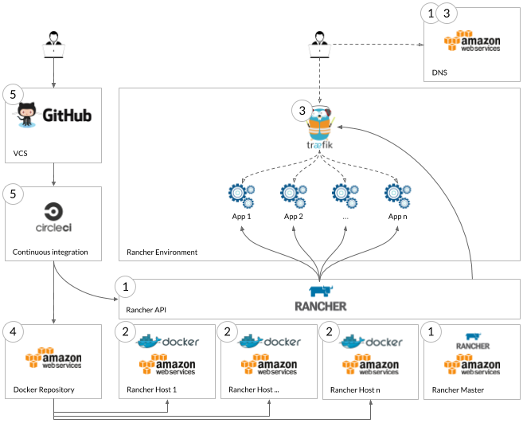

# CI/CD Platform Deployment

This guide describes the *feature branch* workflow we now use everyday, based on Google's managed Kubernetes (GKE).
Each of our projects has its own namespace in Kubernetes. Every new feature is implemented in a new branch.
As shown in the provided [sample project](sample_project), our CI/CD pipeline allows us to create and maintain an
application instance per feature branch, accessible from anywhere (web) and at anytime.
This scheme goes in the direction of our *Definition of Done*, which requires a code review and a validation from a
Product Owner on a production-like environment before deploying to production.

The following guide contains a lot of data and commands gathered from the following resources:
- [Kubernetes' Quickstart](https://cloud.google.com/kubernetes-engine/docs/quickstart)
- [Traefik's official documentation](https://docs.traefik.io)

Read them in details if you want to deep dive into how things work.


## Architecture and outline

Our pipeline uses GitHub for version control, CircleCI for CI/CD, a Google Kubernetes Engine cluster as the deployment
platform, Traefik as ingress controller and load balancer and Let's Encrypt for a fully automated TLS certificates
management. The corresponding architecture is pictured below:



The following sections will describe how to assemble these components step by step in order for you to reproduce our 
pipeline on your own environments in just a few minutes!


## Requirements

For that, you will need
- a Google Cloud account, with full access rights to create and configure a Kubernetes cluster
- a GitHub account, with ability to create and configure projects
- a CircleCI account linked to your GitHub account, with ability to configure and run builds
- to own a domain (e.g., `mywebsite.com`) managed by one of the providers 
[compatible with Traefik](https://docs.traefik.io/https/acme/#dnschallenge)

The following command-line tools must be installed and configured on your computer:
- [gcloud SDK](https://cloud.google.com/sdk/docs/quickstarts)
- [kubectl](https://kubernetes.io/docs/tasks/tools/install-kubectl/)
- htpasswd  (`sudo apt-get install htapasswd`)
- envsubst (`sudo apt-get install gettext`)

Login in gcloud (this command should open a page in your browser asking for access to your Google account):
```shell script
gcloud auth login
```


## 1. Kubernetes cluster

### Deploy a GKE cluster instance on GCP

This can easily be done through the [Cloud Console](https://console.cloud.google.com/kubernetes). The following
instructions do not assume a particular configuration or size for your cluster, except for the HTTP load balancing
add-on, which must be enabled after creation.

### Authenticate to the cluster:

```shell script
gcloud container clusters get-credentials [CLUSTER_NAME]
```


## 2. Traefik

### Create a "traefik" namespace in the cluster

```shell script
kubectl create namespace traefik
```

### Import Traefik's Custom Resource Definitions (CRDs) in the cluster

Apply the [CRD descriptor](crd.yaml):
```shell script
kubectl apply -f crd.yaml
```

### Apply the Role-Based Access Control (RBAC) rules required by Traefik

Apply the [RBAC descriptor](rbac.yaml):
```shell script
kubectl apply -f rbac.yaml
```

This will create the RBAC rules, create a service account for Traefik and bind the rules to the service account.

### Deploy Traefik in the cluster

Create a secret file with a pair user / password hash. These will be the credentials to use to access Traefik's 
dashboard.
```shell script
htpasswd -bc [FILENAME] [USER] [PASSWORD]
```

Import the secret into your cluster's traefik namespace:
```shell script
kubectl create secret generic traefik-auth --from-file [FILENAME] --namespace=traefik
```

In order for Traefik to generate wildcard TLS certificates using Let's Encrypt, it must fulfill a DNS challenge. Since 
our domain is registered with AWS, we use Traefik's Route53 provider to do so (other providers are listed 
[here](https://docs.traefik.io/https/acme/#dnschallenge)). This provider requires the Access Key ID and the Secret 
Access Key of an AWS IAM user with sufficient permissions to edit DNS records.

Fill the following placeholders in the [traefik descriptor](traefik.yaml): 
- `DOMAIN`: the domain you own (e.g., `mywebsite.com`)
- `ACME_EMAIL_ADDRESS`: the contact email address to use to generate the TLS certificates
- `AWS_ACCESS_KEY_ID`: the Access Key ID of the AWS IAM user
- `AWS_SECRET_ACCESS_KEY`: the Secret Access Key of the AWS IAM user
- `AWS_REGION`: the code of your AWS region (can be found in the url when editing your DNS configuration).
- `AWS_HOSTED_ZONE_ID`: the ID of the Hosted Zone in Route53 (can be found in the url when editing your DNS configuration)

Then apply it:
```shell script
kubectl apply -f traefik.yaml
```

This will:
- instantiate a Traefik instance using a Deployment
- expose this Traefik instance on a public IP using a Service of type LoadBalancer
- configure Traefik's entrypoints to listen to ports 80 (http) and 443 (https)
- redirect all http (port 80) traffic to the https entrypoint (port 443) using a RedirectScheme middleware
- expose Traefik's dashboard on the `traefik` subdomain (e.g., `traefik.mywebsite.com`) using an IngressRoute, protected
with a BasicAuth middleware (using the secret created above)
- configure a Traefik certificate resolver to generate wildcard certificates on demand
- create and use the wildcard TLS certificate (e.g., `*.mywebsite.com`) required by the dashboard IngressRoute 

Wait for a bit and get the public IP associated by GKE to the Traefik service:
```shell script
kubectl -n traefik get services
```
The IP will eventually be displayed in the "EXTERNAL-IP" column, but it may take a few seconds.

Configure your DNS records manually to redirect all traffic from your domain to this IP (this is an `A` record from 
`*.mywebsite.com` to the external IP).

Traefik's dashboard should now be accessible on the traefik subdomain (e.g., `traefik.mywebsite.com`) and all http
traffic should be redirected to https with valid Let's Encrypt certificates.


## 3. A first "whoami" toy project

In this section, we will illustrate how to use Traefik to expose multiple instances/branches/versions of a same app on 
subdomains. Suppose we chose to dedicate the `whoami` subdomain (e.g., `whoami.mywebsite.com`) to this project. Our goal
is to expose the master version of the app on a `master` subdomain (e.g., `master.whoami.mywebsite.com`) and the changes
of a `feature1` branch on the `feature1` subdomain (e.g., `feature1.whoami.mywebsite.com`).

For this example, we will use the containous/whoami docker image as a dummy web application, which only serves some 
information about the server and the received request for any request on port 80. 

### Create a namespace for the project

```shell script
kubectl create namespace whoami
```

### Deploy the master version

Fill the following placeholders in the [whoami-master descriptor](whoami-master.yaml): 
- `DOMAIN`: the domain you own (e.g., `mywebsite.com`)

Then apply it:
```shell script
kubectl apply -f whoami-master.yaml
```

This will instantiate 3 instances of the whoami pod, create a service to load balance between them, and expose this
service through an IngressRoute. Notice the use of the `traefik` TLS certificate resolver created in step 2, the 
request for a `*.whoami.[DOMAIN]` wildcard certificate and the use of the `master.whoami.[DOMAIN]` Host rule to route
traffic to this URL to our service. In just a few seconds, the certificate is generated and your application server is
exposed securely on the `master.whoami` of your domain (try it!). 

### Deploy the feature1 branch

Fill the following placeholders in the [whoami-branch1 descriptor](whoami-branch1.yaml): 
- `DOMAIN`: the domain you own (e.g., `mywebsite.com`)

Then apply it:
```shell script
kubectl apply -f whoami-branch1.yaml
```

This will instantiate 3 new instances of the pod, create a new service to load balance between them, and expose this
service through an IngressRoute. Notice again the use of the `traefik` TLS certificate resolver created in step 2, the 
request for a `*.whoami.[DOMAIN]` wildcard certificate (which is already managed by Traefik and will be reused) and the 
use of the `branch1.whoami.[DOMAIN]` Host rule to route traffic to this URL to our service. Your new app instance,
distinct from the master environment is already live (try it!). 

### Use a template

Notice the very few differences between the [whoami-master](whoami-master.yaml) and the 
[whoami-branch1](whoami-branch1.yaml) descriptors: all occurences of `master` have simply be replaced by `branch1`. In 
real world use cases, the docker image will probably be different too.

Take a look at the [whoami-template descriptor template](whoami-template.yaml) file. Env-like placeholders (e.g., 
`${INSTANCE_NAME}`) are used. We will use the `envsubst` tool to instantiate our template.

Fill the following placeholders in the [whoami-template descriptor template](whoami-template.yaml): 
- `DOMAIN`: the domain you own (e.g., `mywebsite.com`)
Do not touch the env-like placeholders.

Set the required environement variables, then instantiate the template and apply it: 
```shell script
export INSTANCE_NAME=branch2
export IMAGE=containous/whoami:v1.5.0
envsubst < whoami-template.yaml > whoami-branch2.yaml
kubectl apply -f whoami-branch2.yaml
```

Quick, your `branch2` instance is already up!

The `envsubst` approach will get you quite far, but if you need a more advanced templating engine (and much more), look
into [Kustomize](https://github.com/kubernetes-sigs/kustomize) or [Helm](https://helm.sh/).


## 4. A "myapp" project with CI/CD

In this section, we will illustrate how the manual deployment described in step 3 can be integrated in about any CI/CD
pipeline. Suppose we chose to dedicate the `myapp` subdomain (e.g., `myapp.mywebsite.com`) to this project. Our goal
is to expose any branch X on the X subdomain (e.g., branch `feat1` exposed on `feat1.myapp.mywebsite.com`, `feat2`
exposed on `feat2.myapp.mywebsite.com`, etc.).

For this example, we will build our own docker image in a CircleCI pipeline. For the sake of simplicity, this guide will
use the same containous/whoami image, but feel free to build your own for real! 

### Create a namespace for the project

```shell script
kubectl create namespace myapp
```

### Create a "myapp" project on GitHub

In the [sample_project](sample_project) folder, fill the following placeholders in the [myapp-template descriptor](sample_project/myapp-template.yaml): 
- `DOMAIN`: the domain you own (e.g., `mywebsite.com`)

Then push the content of the [sample_project](sample_project) folder at the root of your GitHub repository (i.e., the 
`.circleci` folder, the `Dockerfile` and the descriptor template should be visible at the root of your repository).

Notice in particular the [.circleci/config.yml](sample_project/.circleci/config.yml) build configuration file for 
CircleCI (more about the syntax [here](https://circleci.com/docs/2.0/configuration-reference/)).

### Create a CircleCI service account on GCP

This can easily be done in the [Cloud Console](https://console.cloud.google.com/iam-admin/serviceaccounts).

Create a new `CircleCI` account with role `Storage Admin` and `Kubernetes Engine Admin`. Create and download a (JSON) 
key for this account. This technical user will have write access to the Google Container Registry (GCR) of you project 
and permission to deploy to your cluster.


### Build the project on CircleCI

In CircleCI, add your project in the build list in the `Add Projects` tab (use the `Add manually` button, since you have
already committed a `.circleci/config.yml` file).

In the `Settings` tab, find your project in the `Projects` sub-tab and open its settings.

In `Environment Variables`, create the following variables. They are used in the CircleCI configuration and in the
descriptor template.
- `GCP_PROJECT`: The id of your GCP project (visible in the 
[Cloud Console](https://console.cloud.google.com/home/))
- `GCP_AUTH`: The content of the JSON key file created in the previous step.
- `GCP_REGISTRY`: The GCR registry of your choice (`eu.gcr.io/[GCP_PROJECT]` for a storage in Europe)
- `GCP_ZONE`: The GCP Zone in which your cluster is hosted (visible in the 
[Cloud Console](https://console.cloud.google.com/kubernetes/list), e.g., `europe-west3-a`)
- `GCP_KUBE_CLUSTER`: The name of your Kubernetes cluster

Relaunch the build: the master branch is deployed on the `master` subdomain (e.g., `master.myapp.mywebsite.com`).

Create branches on your GitHub repository and push them... and let the magic happen! From source code to production in 
less than 20 secondes!


## 5. Bonus track: delete stale instances in Kubernetes

Now you know how to deploy an instance of your app per GitHub branch in Kubernetes... But how to delete stale instances
in Kubernetes (instances of the app created for branches that are since deleted in GitHub)?

### Add a second job in your CircleCI configuration

As you can see, it involves quite a bit of bash wizardry...

```yaml
jobs:
  build:
    [...]
  delete-stale-ci-stacks:
    docker:
      - image: google/cloud-sdk
    working_directory: /home/circleci/myapp
    steps:
      - checkout
      - run:
        name: Authenticate with GCP
        command: |
          echo ${GCP_AUTH} > /home/circleci/gcp-key.json
          gcloud auth activate-service-account --key-file /home/circleci/gcp-key.json
          gcloud --quiet config set project ${GCP_PROJECT}
          gcloud config set compute/zone ${GCP_ZONE}
          gcloud --quiet container clusters get-credentials ${GCP_KUBE_CLUSTER}
      - run:
        name: Delete stale instances
        command: |
          KUBE_FEATURE_BRANCHES=`kubectl get po -n myapp -l 'app.kubernetes.io/name=myapp' -o jsonpath="{.items[*].metadata.labels['app\.kubernetes\.io/instance']}"`
          GIT_BRANCHES=`git branch --list --remote | sed 's/  origin\///g'`
          for kube_branch in $KUBE_FEATURE_BRANCHES; do
            echo "Checking branch ${kube_branch}"
            git_branch_still_exists=false
            for git_branch in $GIT_BRANCHES; do
              if [ "${git_branch}" == "${kube_branch}" ]; then
                git_branch_still_exists=true
                echo "Git branch ${git_branch} still exists, instance ${kube_branch} will not be deleted."
              fi
            done
            if [ "${git_branch_still_exists}" = false ]; then
              echo "Git branch corresponding to instance ${kube_branch} has been deleted, deleting instance..."
              kubectl delete all,ingressroute -n myapp -l app.kubernetes.io/instance=$kube_branch
            fi
          done
```

### Add the job in a new workflow triggered by a CRON

```yaml
workflows:
  version: 2
  build-test-and-deploy:
    [...]
  delete-stale-deployments:
    triggers:
      - schedule:
        cron: "0 0,6,12,18 * * *" # Every six hours
        filters:
          branches:
            only:
              - master
    jobs:
          - delete-stale-ci-stacks
``` 

## Conclusion

As of this writing, we have been using these tools and techniques for all our projects at Zenika Labs for more than a 
year. We are very happy about it. Feel free to use it, share it, suggest improvements or ask any question!
