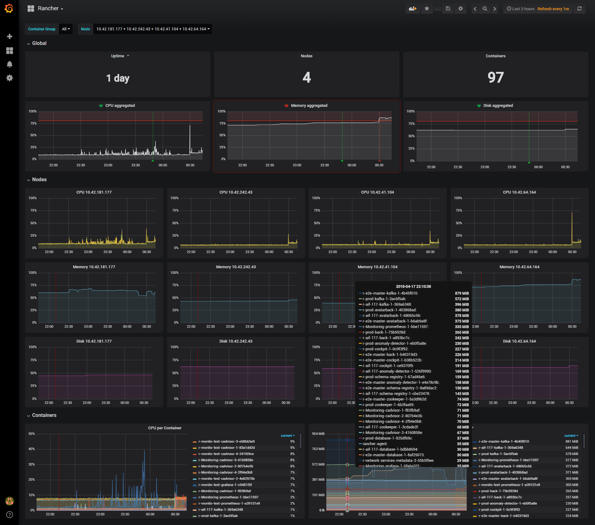

# Rancher Monitoring 

This repository contains the deployment and configuration instructions to monitor our [Rancher platform](../ci-cd-platform-deployment). It uses [Prometheus](https://prometheus.io/), [Grafana](https://grafana.com/) and [cAdvisor](https://github.com/google/cadvisor) and is only a small improvement on top of the work done by [Infinity Works](https://github.com/infinityworks/Guide_Rancher_Monitoring) and published as a Rancher catalog entry.

## Deployment

Simple use the provided `docker-compose.yml` in your Rancher instance.

For email notifications to work, the following environment variables must be set for the `grafana` service (otherwise, they should be removed) :
- `GF_SMTP_ENABLED=true`
- `GF_SMTP_HOST=your.smtp.com:25`
- `GF_SMTP_USER=your_smtp_username`
- `GF_SMTP_PASSWORD=your_smtp_password`
- `GF_SMTP_FROM_ADDRESS=no-reply@your.site.com`
- `GF_SMTP_FROM_NAME=Your sender name`

For Traefik to expose grafana to the outside, the following labels must be set for the `grafana` service (otherwise, they should be removed) :
- `traefik.enable=true`
- `traefik.port=3000`
- `traefik.frontend.rule=Host:grafana.mysite.com`

## Configuration

Once the stack is deployed, access the Grafana instance (the default account is `admin`/`admin`).

### Notification channel

In `Alerting > Notification channels`, click on `Add channel`.

Name it, choose `email` as `Type` and tick `on all alerts` to use this channel by default.

Specify the recipients to be notified by this channel.

### Dashboard

Through the Docker images used by our stack, [Infinity Works](https://github.com/infinityworks/Guide_Rancher_Monitoring) provides default dashboards.

At Zenika Labs, we created a dashboard that best suits our needs and decided to share it. It is specified in the [dashboard.json](dashboard.json) file and can be imported in the `Create > Import` screen.
